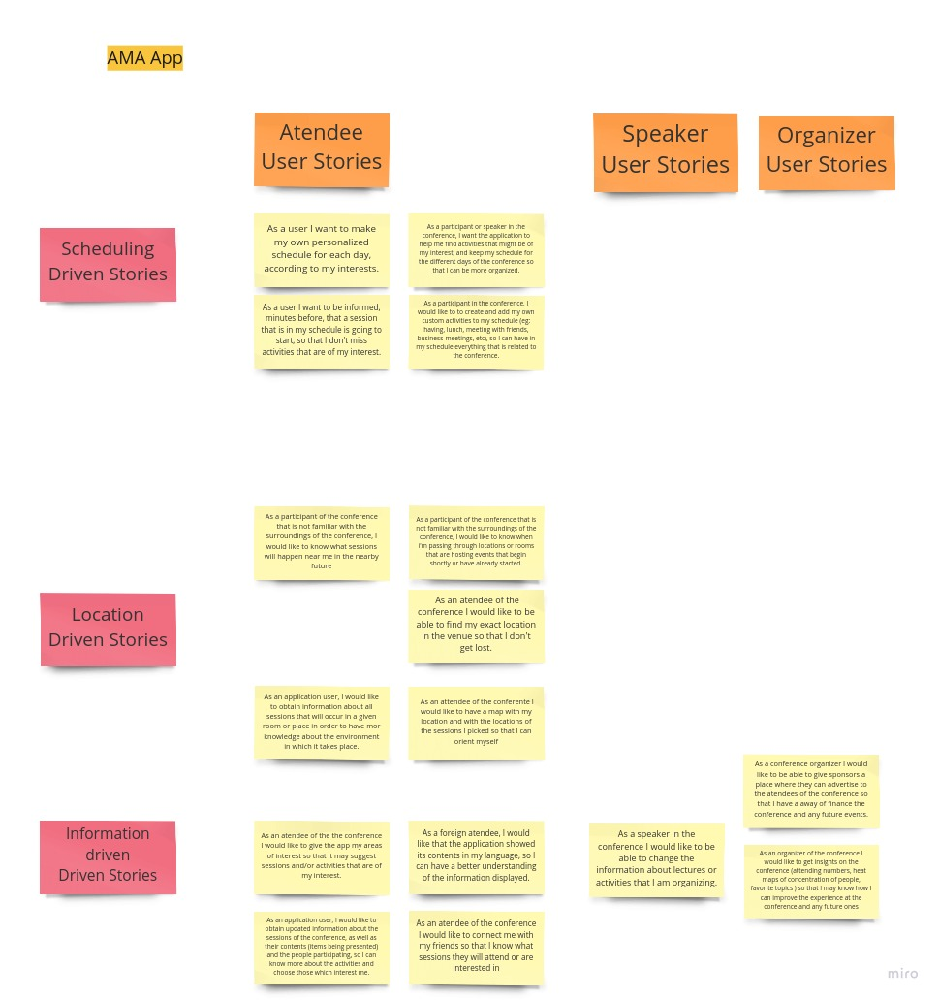
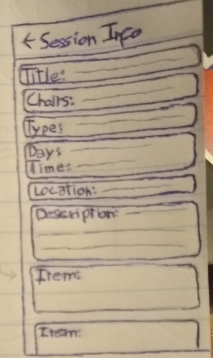
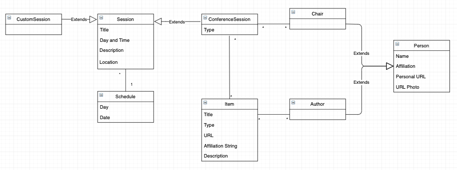
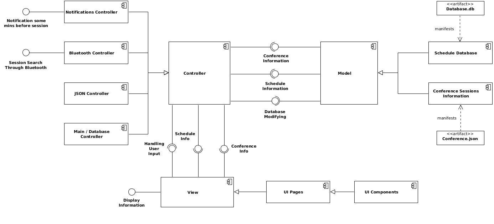
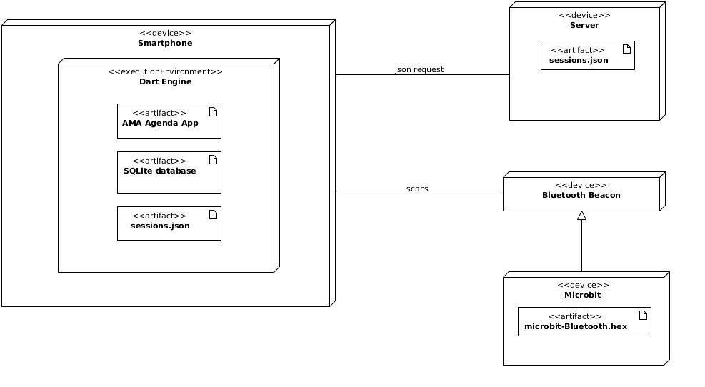
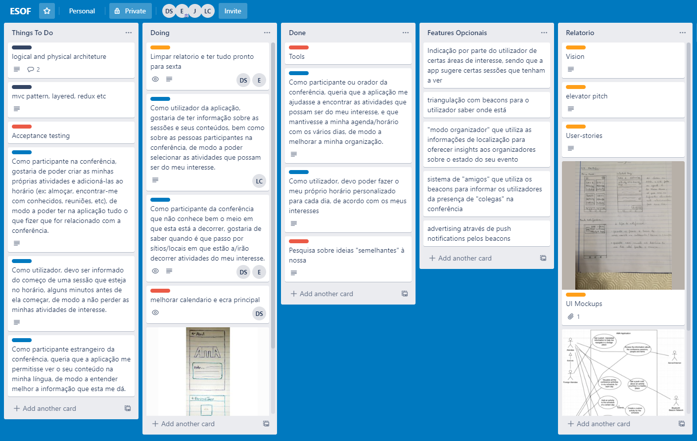
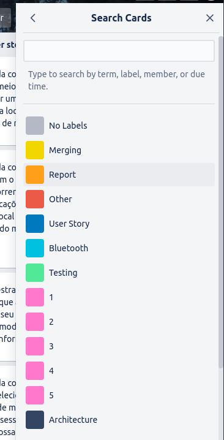
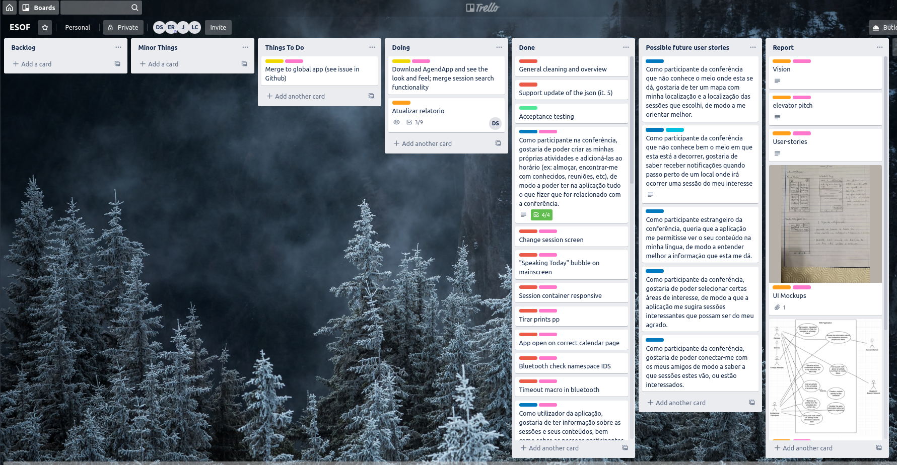

# openCX-*Mr Simba* Development Report

Welcome to the documentation pages of the Agenda Mobile App of **openCX**!

You can find here detailed information about the (sub)product, hereby mentioned as module, from a high-level vision to low-level implementation decisions, a kind of Software Development Report (see [template](https://github.com/softeng-feup/open-cx/blob/master/docs/templates/Development-Report.md)), organized by discipline (as of RUP): 

* Business modeling 
  * [Product Vision](#Product-Vision)
  * [Elevator Pitch](#Elevator-Pitch)

* Requirements

  * [Use Case Diagram](#Use-case-diagram)
  * [User stories](#User-stories)
  * [UI Mockups](#UI-Mockups)
  * [Domain model](#Domain-model)

* Architecture and Design
  * [Logical architecture](#Logical-architecture)
  * [Physical architecture](#Physical-architecture)
  * [Prototype](#Prototype)
  
* [Implementation](#Implementation)
  * [Iteration #1](#Iteration-1)
  * [Iteration #2](#Iteration-2)
  * [Iteration #3](#Iteration-3)
  * [Iteration #4](#Iteration-4)
  * [Iteration #5](#Iteration-5)
  
* [Test](#Test)
* [Configuration and change management](#Configuration-and-change-management)
* [Project management](#Project-management)

So far, contributions are exclusively made by the initial team, but we hope to open them to the community, in all areas and topics: requirements, technologies, development, experimentation, testing, etc.

Please contact us! 

Thank you!

*David Silva*  

*Eduardo Ribeiro*  

*José Gomes*  

*Luís Cunha*  

## Product Vision

"A mobile app connected with the event-space to not only let the attendees organize themselves better, but to also show them everything that the conference has to offer, so they can get the best out of it."

## Elevator Pitch

Here are shown the several iterations of the elevator pitch, so that you can see the evolution of the concept and of the way of presenting it.

### Version 1.a

Our idea for a product that would let the atendees of the conference have a better experience is an agenda application that lets the participants to better organize their schedule. Our app will let the users plan their schedule for each one of the 4 days of the conference. They can of course add and remove activities from their schedule as they will.

However, what sets us apart from other agenda apps is our use of bluetooth beacons, that are distributed throughout the different rooms and areas of the conference. If you get close to one of them, and an activity will start shortly in that area, you will receive a push notification warning you about it, so that you are connected with everything that is happening around you."

However, what sets us apart from other agenda apps is our use of bluetooth beacons, that are distributed throughout the different rooms and areas of the conference. If a user gets close to one of them, and an activity will start shortly in that area, they will receive a push notification warning them about it, so they are informed about everything that is happening around them.""

### Version 1.b

"Have you ever found yourself in a conference spending more time keeping track of events and getting accquainted to the venue rather than networking and getting knowledge?

Our solution for that is an agenda app for your smartphone that lets you, as a participant, organize you schedule. The app let's you plan out your daily activities and warns you before it's time to do them.

However, what sets us apart from other agenda apps is our use of bluetooth beacons, that are distributed throughout the different rooms and areas of the conference. If you get close to one of them, and an activity will start shortly in that area, you will receive a push notification warning you about it, so that you are connected with everything that is happening around you."

### Version 2.a

"Have you ever found yourself in a conference spending more time keeping track of events and getting accquainted to the venue rather than networking and getting knowledge?
Our solution for that is an agenda app for your smartphone that lets you, as a participant, organize you schedule. The app let's you plan out your daily activities and warns you before it's time to do them.

However, what sets us apart from other agenda apps is that our use and connection with the event space, through the use of bluetooth beacons scattered throughout the conference space. You can see all the sessions that are going to start shortly and that are near you, so that you are connected with everything that is happening around you."

## Requirements

As an agenda application, the main requirements of our product are connected to the display of information about the conference, to the customization of the schedules by the user and the warning/notification that an event in the schedule is about to begin. This information must be displayed in a manner that is aesthetically appealing and intuitive to the main user (conference-attendee). Moreover, our requirements are also influenced by the technologies that we are going to use, more specifically the use of bluetooth beacons to inform the user about nearby sessions and events, the parsing of the informations stored in a JSON file, and the querying and display of that information from a database (currently using SQLite). As a mobile application the product needs to have a performance tailored to the capabilities of smartphones.

### Use case diagram 

There are a lot of features and functionalities that we thought about, that would be useful and could be implemented in the future. In order to preserve the readability of this diagram, only the features that we have implemented (and a few extra features that we didn't) are present. For all the user stories that we considered and could be done in the future, please check the user stories board. 

Description of the use cases shown:

####  **Visualize all the conference activities in my schedule, for each day**

* **Actor**: Attendee and conference participant 

* **Description**: The users of our application need to see and know what are the various sessions in each day's schedule.

* **Preconditions and Postconditions**: There are no major preconditions necessary for the use case's execution; the schedule should have at least one activity in it in order to observe anything (obvious).

* **Normal Flow**:
        
    1. User, while in the main screen, navigates between the icons relative to each of the 4 days of the conference, by swiping left or right in the main screen.
    2. User taps on 1 of the 4 icons.
    3. App displays the schedule for that day.

* **Alternative Flows and Exceptions**: If the schedule for a given day is empty, the app will show some text explaning that to the user, and indicating how he or she can add sessions and activities to the schedule.

####  **Add an activity to the schedule of a certain day**

* **Actor**: Attendee and conference participant 

* **Description**: The users of our application need to be able to add sessions and activities to their schedule, so they can customize it as they wish.

* **Preconditions and Postconditions**: The system needs to have the correct and updated information to show the user, regarding the activities for that day, so that the app user can choose those which might be of their interest.

* **Normal Flow**:
        
    1. System is displaying the different activities of the conference for that day.
    2. User picks the activity that he/she wants and swipes to the left, revealing an "add" button.
    3. User clicks the button.
    4. System shows a message telling the user that the activity was indeed added.

* **Alternative Flows and Exceptions**: If the user tries to add an activity that is already in the schedule, it obviously will have no effect (a message will be displayed telling that).

####  **Create a custom activity for the schedule**

* **Actor**: Attendee and conference participant

* **Description**: This can be considered as a sub-use case of adding an activity. The goal is to let the users of the application have in their schedule not only the sessions that they want to attend, but also every other activity related to the conference, such as, for example, a meeting, a reunion, having lunch, etc.

* **Preconditions and Postconditions**: There are no major preconditions that have to be met before the start of this use case. After its execution, the activity created will be added to the day's schedule.

* **Normal Flow**:
        
    1. User selects the option to create a custom activity, in the side drawer of the main page.
    2. User inputs the needed fields to characterize the custom session (title, location, start time, etc).
    3. System creates the custom event and adds it to the schedule

* **Alternative Flows and Exceptions**: If the user enters any invalid input or any required fields are left blank, the application will not create the custom activity and will ask the user to fill in all the fields correctly.

####  **Remove an activity from the schedule of a certain day**

* **Actor**: Attendee and conference participant 

* **Description**: The users of our application need to be able to remove sessions and activities from their schedule, so they can customize it as they wish.

* **Preconditions and Postconditions**: There must be, obviously, at least one activity in the schedule, if we want to remove.

* **Normal Flow**:
        
    1. System is displaying the different activities of the schedule.
    2. User picks the activity that he/she wants and swipes to the left, revealing a "remove" button.
    3. User clicks the button.
    4. System deletes that session from the schedule, no longer displaying it.

* **Alternative Flows and Exceptions**: As said before, is the schedule has no activities, the user can't remove anything.

####  **Get a notification when an activity in the schedule is about to start**

* **Actor**: Attendee and conference participant

* **Description**: In order to remind the user that an activity in the schedule is about to start, roughly 10 minutes before said activity the app will generate a notification with that information.

* **Preconditions and Postconditions**: The app must know at what time the activity starts, so as to create an alarm that generates the notification that warns the user.

* **Normal Flow**:
        
    1. User adds a new session to the schedule.
    2. System tells the operating system to set up an alarm that will fire a notification, 10 mins before its start.
    3. When that time arrives, OP will create the notification (even if app is not launched).
    4. User sees the notification and is informed.

* **Alternative Flows and Exceptions**: As said before, if the application doesn't know the start time of the session (no reason for that to happen) no notification is going to be generated.

####  **Search activities about to start, ocurring in a nearby place**

* **Actor**: Attendee

* **Description**: In order to integrate the user in the conference environment and inform him/her about some activities that might be of his/her interest, the app offers a "Session Search" mode that, through the use of the bluetooth beacon network, shows sessions that will happen in a nearby location and time.

* **Preconditions and Postconditions**: The phone should be able have the capability to connect with the bluetooth beacons, and the app needs be "aware" of time in order to calculate if a session on that location is about to begin or is underway. Moreover, the beacon must be capable of transmiting the needed information to the application.

* **Normal Flow**:
        
    1. User selects the "Session Search" option in the main page.
    2. User clicks the "Search" button (only available if the phone is connected to bluetooth).
    3. System searches and tries to connect with nearby beacons.
    4. Beacons transmit the unique ID of their location to the app.
    5. System gets all the sessions that will happen in less than 15 mins, in those locations, and displays that information.
    6. User sees the information and is informed.

* **Alternative Flows and Exceptions**: If any of the preconditions are not met (for example, phone has bluetooth disabled or beacon cannot send information), this process will not be able to execute. This will also happen, of course, if the phone is out of range of the bluetooth beacons.

####  **Access the information about the conference sessions, people and items**

* **Actor**: Attendee, conference participant 

* **Description**: The users of our application need to see and know what are the various sessions offered by the conference, the items that will be presented in them, and the people that will participate in them, so they can understand what activities they are interested in, in order to build a schedule.

* **Preconditions and Postconditions**: In the first time launching the app, the system needs to be able to estabilish a connection to the server, in order to get a JSON file contaning all the information. After this, all information is stored on a database and the app just accesses that to retrieve information to the user.

* **Normal Flow**:
        
    1. User taps button to see the available activities for that day.
    2. App queries the database to get the information about the sessions for that day.
    3. App displays that information to the user.
    4. User taps on the chairs/items/authors container, in order to know more about them.
    5. App queries the database to get the necessary information, and displays it.

* **Alternative Flows and Exceptions**: If, in the first time launching the app, the phone cannot reach the server to get the JSON file, the app will inform the user and will tell him/her to try again later, when internet connection is available.

####  **Update the app's information about an event im organizing**

* **Actor**: Conference participant/organizer

* **Description**: In order to maintain and keep all the information about the sessions as recent as possible, the conference participants and speakers should be able to update that information whenever is necessary.

NOTE: Right now, the way to do this is by changing the information in the JSON file (the time/day of a session, speaker information, deleting/adding new stuff, etc), so that the app can get the new information from the server and update its local database. In the future, a user interface could be implemented in the app, that allows the organizer to change the information from there, updating the JSON file and, consequently, updating the database.

* **Preconditions and Postconditions**: The app needs to be connected to the internet, in order to get from the server the updated JSON file.

* **Normal Flow**:
        
    1. User chooses option to update the conference information.
    2. App gets, from the server, the new JSON file.
    3. App updates the database information accordingly.
    5. User is now presented with the updated information about the conference.

* **Alternative Flows and Exceptions**: If the phone cannot reach the server to get the JSON file, the app will inform the user and will tell him/her to try again later, when internet connection is available.

### User stories

### #1

> "As a participant or speaker in the conference, I want the application to help me find activities that might be of my interest, and keep my schedule for the different days of the conference so that I can be more organized."
>
> * **Importance:** Must have
> * **Effort to implement:** M 

### #2

> "As a user I want to make my own personalized schedule for each day, according to my interests."
>
> * **Importance:** Must have
> * **Effort to implement:** M 

### #3

> "As a user I want to be informed, minutes before, that a session that is in my schedule is going to start, so that I don't miss activities that are of my interest."
>
> * **Importance:** Should have
> * **Effort to implement:** M 

### #4
> "As a participant of the conference that is not familiar with the surroundings of the conference, I would like to know when i'm passing through locations or rooms that are hosting events that begin shortly or have already started."
>
> * **Importance:** Should have
> * **Effort to implement:** L 

### #5
> "As a participant in the conference, I would like to to create and add my own custom activities to my schedule (eg: having, lunch, meeting with friends, business-meetings, etc), so I can have in my schedule everything that is related to the conference."
>
> * **Importance:** Could have
> * **Effort to implement:** S 

### #6
> "As an application user, I would like to obtain updated information about the sessions of the conference, as well as their contents (items being presented) and the people participating, so I can know more about the activities and choose those which interest me."
>
> * **Importance:** Should have
> * **Effort to implement:** M

### #7
> "As an atendee of the the conference I would like to give the app my areas of interest so that it may suggest sessions and/or activities that are of my interest."
>
> * **Importance:** Should have
> * **Effort to implement:** S

### #7
> "As a foreign atendee, I would like that the application showed its contents in my language, so I can have a better understanding of the information displayed."
>
> * **Importance:** Could have
> * **Effort to implement:** M 

### #8
> As an atendee of the conference I would like to be able to find my exact location in the venue so that I don't get lost.
>
> * **Importance:** Could have
> * **Effort to implement:** L

### #9
> As an organizer of the conference I would like to get insights on the conference (attending numbers, heat maps of concentration of people, favorite topics ) so that I may know how I can improve the experience at the conference and any future ones
>
> * **Importance:** Could have
> * **Effort to implement:** M 

### #10
> As an atendee of the conference I would like to be able to add my friends and collegues to a friend's list in the app so that I am aware if people I know are attending the same conference as I am.
>
> * **Importance:** Could have
> * **Effort to implement:** L 

### #11
> As a conference organizer I would like to be able to give sponsors a place where they can advertise to the atendees of the conference so that I have a away of finance the conference and any future events.
> 
> * **Importance:** Could have
> * **Effort to implement:** L 

### #12
> As a speaker in the conference I would like to be able to change the information about lectures or activities that I am organizing.
> 
> * **Importance:** Should have
> * **Effort to implement:** L 

### UI mockups

Based on the user-stories described above the following mockups were made. To make them we chose the pencil-and-paper approach as it seemed to have more advantages. First, it lacks the need of having to learn a new mockup-drawing environment (like Adobe XD), second, it allows for a more hands-on workflow of editing the mockups in a group and, lastly, we thought that the cleaner look provided by other mockup-drawing options wouldn't really be an advantage as the general look and feel of the app is generaly determined by the environment where it is developed.
As the development moves forward the mockups will be tailored to specific user-stories and will be shown next to them, as such, this sections will be deleted.

### Domain model

---

## Architecture and Design
In this section, we will be talking and showing more about our architecture, from two points of view: the logical point of view, more related to the high-level logical structure of the code, its components and relations between them; and a more physical point of view, portraying the high-level physical structure such as the machines, connections and technologies used.

### Logical architecture
For the logical structure of the code, and in order to separate the different components of the software, we opted to implement the MVC design: the Model contains all the relevant information, the View displays it, and the Controller serves as a kind of "middle man" between them, getting the information from the Model and passing it to the View, and handling the user input from the View buttons, modifying the Model accordingly. We opted to use a design where the Controller is subdivided into smaller Controller modules (having kind of a layered architecture), each having their own roles and methods (JSON Controller, Database Controller, etc), and where a general Controller module is used to connect all the smaller controllers, functioning as a common interface.

### Physical architecture
The physical structure of our solutions is very straightforward. The AMA app will be installed in the user's smarthphone. The app requests the JSON that contains the conference's info from the server, when its launched for the first time. After it parses the JSON, it will store its information in an SQLite database. The app also communicates with beacons as discussed previously ("Session Search" feature). Currently we have microbits serving as Eddystone Beacons.

For this project the main discussion was about what environment/programming language to use to build the mobile app. The two choices were Flutter and React Native. Although React Native has been around for longer than Flutter and, as such, the support for the language is big, we chose Flutter because it was very easy to learn as it is very well documented, very powerfull (has built in widgets tailored to every need) and because it is advantegeous to learn a language that might be popular in the future.  

For the database technology we chose SQLite because of it's small computational needs and for it's simplicity (which is more than enough for the needed task).  
Finally, for our bluetooth technology we chose to use the Eddystone protocol because it eliminates the need to pair with the beacon and , as such, enables a dynamic scan as the user moves arround the event-space.

## Prototype  

In the **initial prototype iteration**, not much of the application was done, in terms of user stories. The main focus was arround what tecnologies and programming languages were going to be used to develop the app, and the final answer ended up being **Flutter**.

It was also discussed, in a general and light way, what would be the **main logical architecture** of the application, and also what **external devices** were going to be used alongside the smartphone, which led to the inclusion of the **bluetooth beacons** in our project.

In terms of the actual application, a very initial **prototype of the main page** was implemented, showcasing buttons to select each of the conference's days.

### [inserir imagem do prototipo aqui]

## Implementation  

##### In this section, we opted to give a brief description about what was done in each of the following iterations.

#### Iteration #1:

In iteration #1, we spent a considerable amount of time learning about Flutter. Despite this, in order to start seeing results and verify our bet on the technologies we chose, we quickly started implementing the basis of the app to deal with our most important user stories. 

Our **first real prototype of the app** consists essentially of the barebone of the agenda part of the app, and it allows the user to consult conference sessions by day and save the favourites in a personalized list.

The **implemented user stories were #1 and #2**. These stories are closely related and were implemented by having a button in the main screen for each day of the conference, allowing the user to navigate to a screen where his favourite sessions for that given day are shown (user story #2). In this screen, by pressing the ADD button, the attendee can consult information about all of the sessions for that day (user story #1), and add the ones that interest him the most
to his personal schedule.

[Link to the iteration #1 github release](https://github.com/softeng-feup/open-cx-mr-simba/releases/tag/iteration1)

#### Images for iteration #1

#### Iteration #2:

In this iteration, the main focus revolved around 2 things: **the start of the implementation of the bluetooth functionality**, and **the organization and structuring of the code**, in order to follow the logical architectural patterns that were discussed in the beginning.

[Link to the iteration #2 github release](https://github.com/softeng-feup/open-cx-mr-simba/releases/tag/iteration2)

#### Images for iteration #2

#### Iteration #3:

On iteration #3, the main focus was the **implementation and usage of a local SQLite database**, in order to keep information about the conference and the user schedules for the different days. The **bluetooth functionality was fully implemented**, and **some visual aspects of the app were refactored**. Furthermore, **some additional information about the sessions, items and people also started to be shown to the user**.

[Link to the iteration #3 github release](https://github.com/softeng-feup/open-cx-mr-simba/releases/tag/iteration3)

#### Images for iteration #3

#### Iteration #4:

On iteration #4, some additional but also very important features were added, like the **generation of a notification roughly 10 mins before a session beggins**; the ability to create **custom sessions** and add them to a day's schedule; a **search bar** for the sessions, etc. **The display of information about the sessions, items and people was finalized**.

[Link to the iteration #4 github release](https://github.com/softeng-feup/open-cx-mr-simba/releases/tag/iteration4)

#### Images for iteration #4

#### Iteration #5:

### [completar]

## Test  

Because the main focus of the testing aspect was mainly just to experiment and learn more about acceptance testing using Gherkin, we opted to choose a set of important functionalities and features and develop some tests to make sure they were working properly. The tests are all done automatically.

Acceptance testing using Gherkin was used to verify if the **drawer of the main page** was working correctly, if the **page slider** in the main page was working correctly, if the **navigation between pages and the adding/removing of sessions in a schedule** was working correctly and if the **display and selecting of the featured speakers** for a certain day was working correctly. For these tests, a special JSON file was used, with some custom sessions to better test the functionalities.

#### Drawer of the main page

A test case was created for each of the different options that can be chosen in the drawer ("About", "Session Search", etc). In each test, the drawer is opened, the option is tapped and the title of the new screen is verified, to see if it corresponds to the expected output.

#### Slider of the main page

Some test cases were implemented in order to verify if the swiping in the main page was working correctly. There is one calendar icon in each section of the slider, each with a unique day identifier.

It was tested the left swipe and the right swipe multiple times (all automated with Gherkin), verifying if the day identifier of the final section of the slider corresponded to the expected output.

#### Navigation between pages and the adding/removing of sessions in a schedule

It was tested, with the help of the custom JSON file, the adding and removing of session to a schedule, doing all the navigation from the main screen to the sessions screen, adding the session, verifying if the session is visible in the schedule screen, and returning to the main screen in order to check the number of activities for that day, displayed in the calender icon. (Again, all of this is done automatically using Gherkin).

#### Display and selection of a featured speaker for a certain day

We also implemented a test case to verify if the display of the featured speakers was working correctly, tapping the speaker's profile icon in the main menu and checking if the app had navigated to his profile page.

[Code for the acceptance tests](https://github.com/softeng-feup/open-cx-mr-simba/tree/master/AMA/test_driver)

## Configuration and change management

As sugested, our team, throughout the development of the project, adopted the use of features and aspects from the Github Flow:

* Use of **branches** for every new feature/change to the code, using easy-to-understand names
* Use of **pull requests** when a certain branch was ready to be added to the master branch
* Revision, discussion and testing of the code for those pull requests, in order to make sure that the pretended functionality was achieved
* Controlled merge of branches to the master branch, so that everything that is implemented in the master branch is final and working correctly

## Project management

The project management tool that we decided to adopt was ***Trello***.

We chose Trello because it is simple to use, free and as a lot of usefull functionalities such as setting deadlines, adding attachments adding responsibilities and notifications. [Link to ***Trello*** board](https://trello.com/invite/b/OL0n3LpN/ce77ec2b856887bb03cf393cffc52317/esof)  

**Initial look at our ***Trello*** layout**:

We used labels in order to organize our cards by theme and iteration:

### Adopted ***Trello*** layout 

During most of the project with adopted a simple layout that has the following lists:  

* **Backlog** - Contains all of the features and tasks that must be done/implemented in the future.
* **Minor Things** - To avoid cluttering of the **Backlog** and **Things To Do** lists, this list contains small bugfixes or ajustments that must be made. (also serves as a "brainstorming" list)
* **Things To Do** - Contains features and tasks that must be done/implemented in the current iteration and/or nearby future
* **Doing** - Contains features and tasks that are currently in development.
* **Done** - Contains features and tasks that have been completed.
* **Possible future user stories** - This list is not very "active" and only serves as a place where  future user-story ideas and plans and placed.
* **Report** - Tasks, notes and discussion related to the report development. The report has it's own list because it is a ever-changing "large" element throughout the project development

**Last iteration look at our ***Trello*** layout**:

